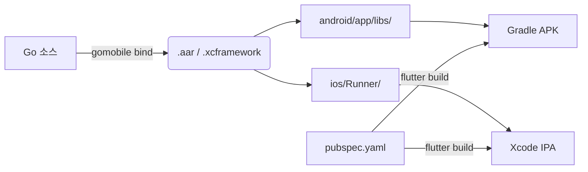

# BitBox02 Nova (Bitcoin-only) Integration Plan for Coconut Wallet

## 전체 통신 아키텍처

```
Dart (Flutter)
  │  MethodChannel (bitbox02)
  ▼
Kotlin (Android) / Swift (iOS)
  │  gomobile bind (bitboxbridge.aar / .xcframework)
  ▼
Go (bitbox02-api-go)
  ├── u2fhid.NewCommunication(transport, 0xC1)  // U2F HID 64바이트 프레이밍
  ├── firmware.NewDevice()                       // Noise 핸드셰이크 + protobuf
  └── device.BTCSignPSBT() / BTCAddress()          // Bitcoin API
  │
  ▼
Transport (io.ReadWriteCloser)
  ├── Android: UsbDeviceConnection.bulkTransfer()
  └── iOS:     CBPeripheral.writeValue(.withResponse) + notify
  │
  ▼
BitBox02 Nova (BLE or USB)
```

## 사용할 외부 라이브러리

### Go 모듈 (coconut_wallet/go/)

| 패키지 | 용도 | 비고 |
|--------|------|------|
| `github.com/BitBoxSwiss/bitbox02-api-go` | BitBox02/Nova 통신 전체 | 핵심 라이브러리 |
| `github.com/BitBoxSwiss/bitbox02-api-go/communication/u2fhid` | 64바이트 U2F HID 패킷 프레이밍 | `NewCommunication(io.ReadWriteCloser, cmd)` |
| `github.com/BitBoxSwiss/bitbox02-api-go/api/firmware` | Device API (NewDevice, Init, BTCSign, BTCAddress 등) | Noise 핸드셰이크 포함 |
| `github.com/BitBoxSwiss/bitbox02-api-go/api/common` | Product 상수 (Nova: `ProductBitBox02PlusMulti/BTCOnly`) | |
| `github.com/BitBoxSwiss/bitbox02-api-go/util/semver` | 펌웨어 버전 파싱 | |
| `github.com/flynn/noise` | Noise_XX_25519_ChaChaPoly_SHA256 | 간접 의존 |

### Go에서 사용하지 않을 것

| 패키지 | 이유 |
|--------|------|
| `github.com/BitBoxSwiss/bitbox-wallet-app` | 전체 앱. bitbox02-api-go를 import만 할 뿐 통신 구현 없음 |
| `api/firmware/eth.go` | bitcoin-only |
| `api/firmware/cardano.go` | bitcoin-only |
| `communication/u2fhid/hiddevice/hiddevice.go` | macOS desktop HID 전용 (모바일에선 불필요) |
| `github.com/bitbox-swiss/bitbox02-api-go/communication/u2fhid` | → 이건 씀 (위에 정리) |

## U2F HID 프레이밍 (최하위 전송 계층)

모든 통신은 64바이트 패킷 기반.

**초기 프레임** (7바이트 헤더 + 57바이트 페이로드):
```
[4B CID=0xff000000][1B CMD=0xC1][2B dataLen][57B data]
```

**연속 프레임** (5바이트 헤더 + 59바이트 페이로드):
```
[4B CID=0xff000000][1B seq#][59B data]
```

**CMD 값:**
- `0xC1` (0x80 + 0x40 + 0x01) = firmware (bitboxCMD)
- `0xC3` (0x80 + 0x40 + 0x03) = bootloader (bitbox02BootloaderCMD)

Go의 `u2fhid.Communication.Query(request)`가 이 프레이밍을 처리하므로 직접 구현 불필요.

## 기기 식별 (Nova vs Classic)

`api/common/common.go`의 상수:

| 제품 | Product 상수 | USB/BLE 문자열 |
|------|-------------|----------------|
| BitBox02 Multi | `ProductBitBox02Multi` | `"BitBox02"` |
| BitBox02 BTC-only | `ProductBitBox02BTCOnly` | `"BitBox02BTC"` |
| **BitBox02 Nova Multi** | **`ProductBitBox02PlusMulti`** | **`"BitBox02 Nova Multi"`** |
| **BitBox02 Nova BTC-only** | **`ProductBitBox02PlusBTCOnly`** | **`"BitBox02 Nova BTC-only"`** |
| Nova Multi Bootloader | `ProductBitBox02PlusMulti` | `"BitBox02 Nova Multi bl"` |
| Nova BTC-only Bootloader | `ProductBitBox02PlusBTCOnly` | `"BitBox02 Nova BTC-only bl"` |

Nova 감지는 OP_INFO 응답의 `platformByte == 0x02`로 자동 감지되거나, 위 Product 문자열 매칭으로 판별.

## Noise Protocol 채널

- **Cipher suite:** `Noise_XX_25519_ChaChaPoly_SHA256`
- **패턴:** `HandshakeXX` (Initiator)
- **Prologue:** `"Noise_XX_25519_ChaChaPoly_SHA256"`
- **키 저장:** `ConfigInterface` -> GetAppNoiseStaticKeypair / SetAppNoiseStaticKeypair (앱 재시작 간 유지)
- **BLE 전용 옵션:** `firmware.WithOptionalNoisePairingConfirmation(true)` // BLE 자체 암호화로 MITM 불필요

모두 `firmware.NewDevice()` + `device.Init()` 내부에서 자동 처리.

## 초기화 순서 (Go)

```go
import (
    "github.com/BitBoxSwiss/bitbox02-api-go/api/firmware"
    "github.com/BitBoxSwiss/bitbox02-api-go/api/common"
    "github.com/BitBoxSwiss/bitbox02-api-go/communication/u2fhid"
)

// 1. 네이티브 측에서 USB/BLE transport 생성
// Android: UsbDeviceConnection.bulkTransfer()
// iOS:     CBPeripheral.writeValue() + notify
var transport io.ReadWriteCloser = nativeSide.Open()

// 2. U2F HID 프레이밍 래핑
comm := u2fhid.NewCommunication(transport, 0xC1) // firmware CMD

// 3. ConfigInterface 구현 (Noise 키 저장)
config := &myConfig{/* Realm/SecureStorage 백엔드 */}

// 4. Device 생성
device := firmware.NewDevice(
    nil, nil,       // version, product (nil = OP_INFO로 자동감지)
    config,
    comm,
    logger,
    firmware.WithOptionalNoisePairingConfirmation(true), // BLE면 추가
)

// 5. Init = attestation + unlock + noise pairing
if err := device.Init(); err != nil { ... }

// 6. Bitcoin API 호출
xpub, err := device.BTCXPub( /* derivation path */ )
addr, err := device.BTCAddress( ... )
err := device.BTCSignPSBT(coin, psbtPacket, options) // PSBT in-place 서명
```

## Bitcoin API Surface (bitcoin-only 기준)

`api/firmware/btc.go` + `psbt.go`에서 제공하는 함수들:

| 함수 | 설명 |
|------|------|
| `BTCXPub(path, display, ...)` | xpub 내보내기 |
| `BTCAddress(path, ...)` | 주소 생성 |
| `BTCSign(coin, scriptConfigs, outputScriptConfigs, tx, formatUnit)` | 원시 TX 서명 (protobuf `BTCTx` 입력) |
| `BTCSignPSBT(coin, psbt_, options)` | **PSBT 서명 (핵심 API)** — `*psbt.Packet`을 in-place 수정 |
| `BTCSignMessage(path, msg)` | 메시지 서명 |
| `BTCPaymentRequest(...)` | Payment request 확인 |

※ 핵심 API: `BTCSignPSBT()`는 `btcutil/psbt.Packet`을 받아 서명을 해당 PSBT에 직접 추가한다 (반환값 없음, in-place mutation). gomobile 바인딩에서는 `[]byte` 기반 래퍼 함수로 우회 (아래 gomobile 제약 참조).

## 모바일 구현 전략 (gomobile)

### 프로젝트 구조

```
coconut_wallet/
├── go/                              # 새 Go 모듈
│   ├── go.mod
│   │   require github.com/BitBoxSwiss/bitbox02-api-go
│   │   require github.com/flynn/noise
│   │
│   ├── bridge.go                    # gomobile export (exported symbols)
│   │   ├── Connect(jsonConfig) (string, error)        // transport 연결
│   │   ├── Init(deviceID string) (string, error)      // Noise pairing
│   │   ├── BTCXPub(deviceID, path string) (string, error)
│   │   ├── BTCAddress(deviceID, path string) (string, error)
│   │   ├── BTCSignPSBT(deviceID string, psbtBytes []byte) ([]byte, error)
│   │   ├── SaveConfig(deviceID string, configJSON string) error
│   │   ├── LoadConfig(deviceID string) (string, error)
│   │   └── Disconnect(deviceID string) error
│   │
│   ├── device_manager.go            // 다중 기기 관리
│   ├── config_impl.go               // ConfigInterface 구현 (gomobile-friendly)
│   └── transport_adapter.go         // GoReadWriteCloserInterface → io.ReadWriteCloser
│
├── android/
│   └── app/
│       ├── libs/
│       │   └── bitboxbridge.aar     // gomobile bind -target=android 출력물
│       └── src/main/kotlin/.../
│           ├── MainActivity.kt      // + MethodChannel "bitbox02"
│           ├── Bitbox02UsbManager.kt   // USB 핫플러그 + bulkTransfer
│           └── UsbTransport.kt      // GoReadWriteCloserInterface 구현
│
├── ios/
│   └── Runner/
│       ├── BitboxBridge.xcframework // gomobile bind -target=ios 출력
│       ├── AppDelegate.swift        // + MethodChannel "bitbox02"
│       └── BluetoothTransport.swift // GoReadWriteCloserInterface (BLE)
│
└── lib/
    └── services/
        └── hardware_wallet/
            ├── bitbox02_device.dart   // Dart 측 MethodChannel 호출
            ├── bitbox02_types.dart    // 응답 타입 정의
            └── bitbox02_exceptions.dart
```

### gomobile bind 명령어

```bash
cd go/
gomobile bind -target=android \
  -o ../android/app/libs/bitboxbridge.aar \
  -androidapi 23 \
  .

gomobile bind -target=ios \
  -o ../ios/Runner/bitboxbridge.xcframework \
  .
```

### Platform Channel 인터페이스 (Dart ↔ Native)

```dart
const _channel = MethodChannel('bitbox02');

// 연결
final deviceId = await _channel.invokeMethod('connect', {
  'transport': 'ble',          // 'usb' | 'ble'
  'identifier': 'XX:XX:XX...', // BLE MAC or USB device name
});

// 초기화 (Noise pairing)
await _channel.invokeMethod('init', {'id': deviceId});

// Bitcoin 주소
final address = await _channel.invokeMethod('btcAddress', {
  'id': deviceId,
  'path': "m/84'/0'/0'/0/0",
});

// PSBT 서명
final signedPsbt = await _channel.invokeMethod('btcSignPSBT', {
  'id': deviceId,
  'psbtBytes': base64Psbt,  // gomobile bridge에서 []byte로 변환 후 BTCSignPSBT 호출
});
```

### gomobile 제약 및 우회 전략

gomobile bind는 다음 Go 타입을 네이티브 측으로 직접 노출할 수 없다:

| 제약 타입 | 사용처 | 우회 전략 |
|----------|--------|----------|
| `*noise.DHKey` | `ConfigInterface` | Go 인메모리에 저장 + `SaveConfig`/`LoadConfig`로 JSON 직렬화 |
| `*psbt.Packet` | `BTCSignPSBT` | `bridge.go`에서 `[]byte` ↔ `*psbt.Packet` 변환 래퍼 함수 작성 |
| `*messages.BTCScriptConfigWithKeypath` | `BTCSign` | 내부에서만 사용, Dart에는 `[]byte`만 노출 |
| `*semver.SemVer` | `NewDevice` | `nil` 전달 → OP_INFO로 자동 감지 |

`bridge.go`의 `BTCSignPSBT` 래퍼 예시:
```go
import "github.com/btcsuite/btcd/btcutil/psbt"

func BTCSignPSBT(deviceID string, psbtBytes []byte) ([]byte, error) {
    psbtPacket, err := psbt.NewFromRawBytes(bytes.NewReader(psbtBytes), false)
    // ...
    device.BTCSignPSBT(coin, psbtPacket, options) // in-place 수정
    // ...
    var buf bytes.Buffer
    psbtPacket.Serialize(&buf)
    return buf.Bytes(), nil
}
```

## Noise 키 저장소 (ConfigInterface)

`ConfigInterface`는 앱 재시작 간 Noise 키를 유지해야 함.

`*noise.DHKey`, `[]byte` pubkey 같은 Go 타입이 gomobile 경계를 넘을 수 없으므로, Go 측에 **인메모리 저장소**로 구현한 뒤 `bridge.go`에 `SaveConfig`/`LoadConfig` 함수를 노출시켜 Dart 측에서 Realm/SecureStorage에 JSON 직렬화하여 저장/로드한다.

| Go 인터페이스 | gomobile 노출 | 실제 저장소 |
|--------------|---------------|------------|
| `ContainsDeviceStaticPubkey` | `SaveConfig(deviceID, configJSON)` | Realm 또는 `flutter_secure_storage` |
| `AddDeviceStaticPubkey` | `LoadConfig(deviceID) → configJSON` | Realm 또는 `flutter_secure_storage` |
| `GetAppNoiseStaticKeypair` | (configJSON 내 포함) | 앱 고정 Noise 키 |
| `SetAppNoiseStaticKeypair` | (configJSON 내 포함) | 앱 고정 Noise 키 |

**흐름:**
1. `Init()` 호출 전 Dart가 `LoadConfig()`로 이전 세션 config를 Go로 복원
2. `Init()` 실행 → ConfigInterface 호출 → Go 인메모리에서 응답
3. `Init()` 완료 후 Dart가 `SaveConfig()`로 갱신된 config를 영속 저장소에 저장

## iOS BLE 상세

BLE 서비스 UUID:

| 구분 | UUID |
|------|------|
| Service | `e1511a45-f3db-44c0-82b8-6c880790d1f1` |
| Writer (Tx, .withResponse) | `799d485c-d354-4ed0-b577-f8ee79ec275a` |
| Reader (Rx, notify) | `419572a5-9f53-4eb1-8db7-61bcab928867` |
| Product 특성 (notify) | `9d1c9a77-8b03-4e49-8053-3955cda7da93` |

BLE Product 문자열 → USB descriptor 매핑:

| BLE Product | 매핑 결과 |
|------------|-----------|
| `bb02p-multi` | `BitBox02 Nova Multi` |
| `bb02p-btconly` | `BitBox02 Nova BTC-only` |
| `bb02p-bl-multi` | `BitBox02 Nova Multi bl` |
| `bb02p-bl-btconly` | `BitBox02 Nova BTC-only bl` |

Android BLE는 Nova가 USB HID만 지원하므로 해당 없음 (Nova BLE는 iOS 전용).

## Android USB 상세

- Vendor ID: `0x03eb` (= 1003)
- Product ID: `0x2403` (= 9219)
- USB 필터: `device_filter.xml`에 `<usb-device vendor-id="1003" product-id="9219" />`
- 엔드포인트: bulk IN/OUT, 64바이트 report size
- 권한: `requestPermission()` → `PendingIntent` → 확인 후 `bridge.Connect()`
- 분리 감지: `UsbManager` BroadcastReceiver → `Disconnect()`

## 빌드 플로우



## TODO

- [ ] `coconut_wallet/go/` 디렉토리 생성 + `go.mod` 초기화
- [ ] `bridge.go` gomobile export 함수 작성
- [ ] `transport_adapter.go` gomobile-friendly ReadWriteCloser 래퍼
- [ ] `config_impl.go` ConfigInterface (Realm 백엔드)
- [ ] Android: `Bitbox02UsbManager.kt` (USB 핫플러그 + permission + bulkTransfer)
- [ ] Android: `MainActivity.kt`에 MethodChannel "bitbox02" 추가
- [ ] Android: `device_filter.xml` + AndroidManifest.xml USB 권한
- [ ] iOS: `BluetoothTransport.swift` (BLE scan + 연결 + read/write)
- [ ] iOS: `AppDelegate.swift`에 MethodChannel "bitbox02" 추가
- [ ] iOS: Info.plist에 `NSBluetoothPeripheralUsageDescription` 추가
- [ ] Dart: `bitbox02_device.dart` MethodChannel 래퍼
- [ ] Dart: PSBT 서명 흐름 연결 (`BTCSignPSBT` → Coconut Vault 연동)
- [ ] `config_impl.go`: 인메모리 ConfigInterface + JSON 직렬화/역직렬화 구현
- [ ] Dart: `SaveConfig`/`LoadConfig` 호출 → Realm/SecureStorage 영속 저장
