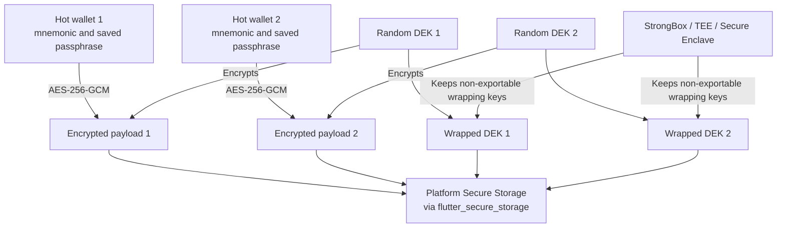
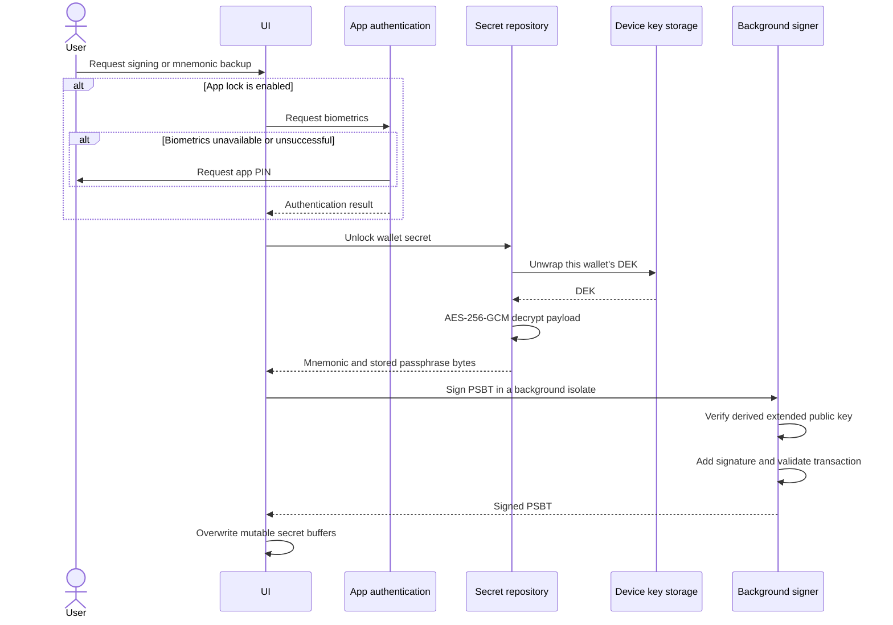

# Hot Wallet Security Architecture

This document explains how Coconut Wallet protects hot-wallet secrets. It is written for both users who want to understand the security model and developers who maintain the implementation.

## What users should know

- Hot-wallet support is optional. Coconut Wallet remains focused on the watch-only experience.
- A hot wallet keeps its signing secret on the online phone. It is more convenient, but it does not have the same isolation as a watch-only wallet paired with an offline signer.
- Each hot wallet is encrypted independently. It does not share one encryption key with every other hot wallet in the app.
- Coconut Wallet requires a device screen lock at the time a hot wallet is created or restored.
- App lock is optional. When enabled, signing and mnemonic access require biometrics or the app PIN.
- A mnemonic backup is still essential. Device loss, app deletion, storage corruption, or loss of a device-bound key can make the wallet unavailable.

## Stored data

The mnemonic and the passphrase selected for storage are encoded as bytes and encrypted with AES-256-GCM. A fresh random 256-bit data encryption key (DEK) is generated for every hot wallet.

The encrypted payload contains:

```text
[mnemonic length][mnemonic bytes][passphrase length][passphrase bytes]
```

The stored secret record contains the encrypted payload, its nonce and authentication tag, the wrapped DEK, the protection method, and the device-key alias. Coconut Wallet writes this record to platform Secure Storage through `flutter_secure_storage`. It does not store the mnemonic as plaintext, and the Secure Enclave, StrongBox, or TEE stores the device wrapping key rather than the mnemonic itself.



On the hardware-backed path, Secure Storage holds only the encrypted payload and wrapped DEK; the non-exportable wrapping key stays in StrongBox, the TEE, or Secure Enclave. On the fallback path, Secure Storage also holds the separate random key used to wrap the DEK.

Using a separate DEK and device-key alias for each wallet limits the effect of a problem involving one wallet's encrypted record or key lifecycle.

## Device key protection

Coconut Wallet attempts the strongest supported device-backed path first.

| Platform | Preferred protection | Implementation |
|---|---|---|
| Android | StrongBox, then hardware-backed TEE | A non-exportable RSA-2048 key in Android Keystore wraps the wallet DEK with OAEP-SHA-256. Software-backed Keystore keys are rejected. |
| iOS | Secure Enclave | A permanent Secure Enclave P-256 key wraps the wallet DEK with ECIES using SHA-256 and AES-GCM. |
| Unsupported environment | Platform Secure Storage fallback | A separate random 256-bit key is stored in Secure Storage and wraps the DEK with AES-256-GCM. |

The fallback preserves encryption at rest but does not provide the same hardware separation as StrongBox, a hardware-backed TEE, or Secure Enclave.

The device keys currently protect key material from export, but they are not configured to require an operating-system authentication prompt for every unwrap. Coconut Wallet applies its optional app-lock policy before sensitive actions.

## Authentication, unlock, and signing



Before signing, the derived extended public key must match the wallet being used. This prevents a mnemonic or passphrase for another wallet from signing through the wrong wallet record. The resulting PSBT is also parsed and checked as a signed transaction before it is returned.

Secret values are handled as mutable byte arrays where practical. The implementation overwrites the DEK, mnemonic, passphrase, decoded payload, and signing copies after use. This is a best-effort memory hygiene measure; managed runtimes and platform channels may create internal copies that the application cannot reliably erase.

## BIP39 passphrase choices

When a user enables a BIP39 passphrase, Coconut Wallet supports two policies:

- **Save the passphrase:** the passphrase is encrypted together with the mnemonic and can be used after authentication.
- **Enter it when signing:** only the mnemonic is stored; the user supplies the passphrase for signing. Coconut Wallet derives the wallet and compares its extended public key with the expected wallet before signing.

An incorrect passphrase derives a different wallet and fails the identity check.

## Deletion and lifecycle cleanup

Deleting a hot wallet removes its encrypted payload, fallback wrapping key if present, secret index entry, and device-key alias. Creation failures also attempt to roll back every partially created record. Startup cleanup removes unreferenced hot-wallet hardware aliases left by interrupted operations.

Because each wallet has its own secret record and alias, deleting one hot wallet does not intentionally remove the keys for another hot wallet.

## Security boundaries

This design protects hot-wallet material at rest and reduces the time plaintext is kept by application code. It does not turn an online phone into an offline signer.

The design cannot fully protect funds when:

- the operating system, app process, or device is already compromised;
- the device is rooted or jailbroken and platform security guarantees are bypassed;
- malicious code can observe secrets while the wallet is legitimately unlocked;
- the user has no valid mnemonic backup and loses access to the device-bound key;
- an unsupported environment uses the Secure Storage fallback and that storage is compromised.

For stronger isolation, use a watch-only wallet with Coconut Vault or another supported external signer.

## Main implementation files

- [`lib/services/wallet/hot_wallet_crypto_service.dart`](../../lib/services/wallet/hot_wallet_crypto_service.dart): payload encoding and AES-256-GCM encryption
- [`lib/repository/secure_storage/hot_wallet_secret_repository.dart`](../../lib/repository/secure_storage/hot_wallet_secret_repository.dart): secret storage, DEK wrapping, fallback, deletion, and cleanup
- [`lib/services/security/device_dek_keystore.dart`](../../lib/services/security/device_dek_keystore.dart): Dart interface for native device-key operations
- [`android/app/src/main/kotlin/onl/coconut/wallet/DeviceDekKeystoreHandler.kt`](../../android/app/src/main/kotlin/onl/coconut/wallet/DeviceDekKeystoreHandler.kt): Android StrongBox and TEE implementation
- [`ios/Runner/DeviceDekKeystore.swift`](../../ios/Runner/DeviceDekKeystore.swift): iOS Secure Enclave implementation
- [`lib/services/security/hot_wallet_unlock_service.dart`](../../lib/services/security/hot_wallet_unlock_service.dart): authenticated mnemonic access
- [`lib/services/security/hot_wallet_signing_service.dart`](../../lib/services/security/hot_wallet_signing_service.dart): wallet verification, signing, and memory cleanup
- [`lib/screens/common/flutter_hot_wallet_authenticator.dart`](../../lib/screens/common/flutter_hot_wallet_authenticator.dart): biometric and app-PIN policy
